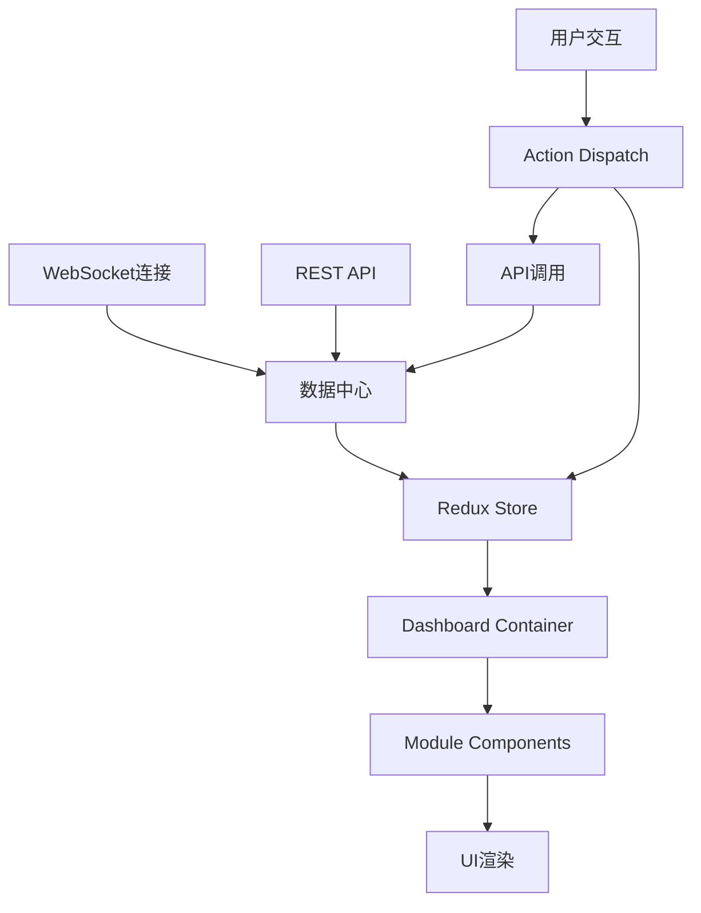

# QuantMind 模块化仪表盘重新设计方案

## 1. 设计分析

### 1.1 截图风格分析
基于提供的截图，该仪表盘展现了以下特点：
- **整体布局**：左侧深色导航栏 + 右侧浅色主内容区域的经典布局
- **模块化设计**：采用卡片式组件，每个功能模块独立封装
- **信息层次**：清晰的信息架构，从概览到详细数据的递进式展示
- **视觉风格**：现代化扁平设计，配色简洁专业

### 1.2 核心模块识别
从截图中可以识别出以下核心模块：
1. **资金概览模块** - 显示总资产、可用资金、持仓市值等关键指标
2. **持仓明细模块** - 展示股票持仓详情和收益情况
3. **市场数据模块** - 实时行情和技术指标
4. **新闻资讯模块** - 相关财经新闻和公告
5. **图表分析模块** - 各类数据可视化图表
6. **交易记录模块** - 历史交易和操作记录

## 2. 重新设计方案

### 2.1 整体架构设计

#### 布局结构
```
┌─────────────────────────────────────────────────────────┐
│  Header (顶部导航栏)                                      │
├──────────┬──────────────────────────────────────────────┤
│          │  主内容区域 (Main Content Area)                │
│  侧边栏   │  ┌─────────────┬─────────────┬─────────────┐  │
│          │  │   模块1     │   模块2     │   模块3     │  │
│ (Sidebar)│  │ (资金概览)   │ (持仓明细)   │ (市场数据)   │  │
│          │  └─────────────┴─────────────┴─────────────┘  │
│          │  ┌─────────────┬─────────────┬─────────────┐  │
│          │  │   模块4     │   模块5     │   模块6     │  │
│          │  │ (图表分析)   │ (新闻资讯)   │ (交易记录)   │  │
│          │  └─────────────┴─────────────┴─────────────┘  │
└──────────┴──────────────────────────────────────────────┘
```

#### 响应式网格系统
- **桌面端**: 3列网格布局 (4:4:4)
- **平板端**: 2列网格布局 (6:6)
- **移动端**: 单列堆叠布局 (12)

### 2.2 模块化组件设计

#### 2.2.1 基础组件架构
```typescript
interface DashboardModule {
  id: string;
  title: string;
  type: ModuleType;
  size: GridSize;
  position: GridPosition;
  config: ModuleConfig;
  data: any;
  loading: boolean;
  error?: string;
}

type ModuleType = 
  | 'fund-overview'
  | 'position-detail'
  | 'market-data'
  | 'chart-analysis'
  | 'news-feed'
  | 'trade-history'
  | 'custom';
```

#### 2.2.2 核心模块规格

**1. 资金概览模块 (FundOverviewModule)**
- **功能**: 展示总资产、可用资金、持仓市值、今日盈亏等核心财务指标
- **布局**: 2x2网格，支持快速概览和详细视图切换
- **数据源**: 用户账户API
- **更新频率**: 实时更新

**2. 持仓明细模块 (PositionDetailModule)**
- **功能**: 显示股票持仓列表，包括代码、名称、数量、成本、市值、盈亏
- **布局**: 表格形式，支持排序和筛选
- **交互**: 点击可查看个股详情
- **数据源**: 持仓数据API

**3. 市场数据模块 (MarketDataModule)**
- **功能**: 展示大盘指数、热门股票、涨跌排行
- **布局**: 多标签页设计
- **数据源**: 市场行情API
- **更新频率**: 每秒更新

**4. 图表分析模块 (ChartAnalysisModule)**
- **功能**: K线图、技术指标、资产配置饼图
- **布局**: 可切换的图表类型
- **交互**: 支持缩放、时间范围选择
- **数据源**: 行情数据API + 技术分析API

**5. 新闻资讯模块 (NewsFeedModule)**
- **功能**: 财经新闻、公司公告、市场分析
- **布局**: 时间线形式
- **交互**: 点击展开详情
- **数据源**: 新闻API

**6. 交易记录模块 (TradeHistoryModule)**
- **功能**: 历史交易记录、委托状态
- **布局**: 表格 + 筛选器
- **数据源**: 交易记录API

### 2.3 视觉设计规范

#### 2.3.1 设计系统
```scss
// 主色调
$primary-color: #1890ff;      // 主蓝色
$success-color: #52c41a;      // 成功绿
$warning-color: #faad14;      // 警告橙
$error-color: #f5222d;        // 错误红
$info-color: #13c2c2;         // 信息青

// 中性色
$text-primary: #262626;       // 主文本
$text-secondary: #595959;     // 次要文本
$text-disabled: #bfbfbf;      // 禁用文本
$border-color: #d9d9d9;       // 边框色
$background-color: #f0f2f5;   // 背景色

// 卡片样式
$card-shadow: 0 2px 8px rgba(0, 0, 0, 0.09);
$card-radius: 8px;
$card-padding: 24px;
```

#### 2.3.2 组件样式规范
- **卡片容器**: 白色背景，圆角8px，阴影效果
- **标题栏**: 16px字体，加粗，带操作按钮区域
- **数据展示**: 数字突出显示，涨跌用红绿色区分
- **图表配色**: 使用品牌色系，确保可读性

### 2.4 交互设计模式

#### 2.4.1 模块交互
- **拖拽排序**: 支持模块位置调整
- **大小调整**: 支持模块尺寸变更
- **展开/收起**: 支持模块最小化
- **全屏查看**: 支持模块全屏显示
- **自定义配置**: 每个模块支持个性化设置

#### 2.4.2 数据交互
- **实时更新**: WebSocket连接保证数据实时性
- **加载状态**: 统一的加载动画和骨架屏
- **错误处理**: 优雅的错误提示和重试机制
- **数据筛选**: 支持时间范围、股票代码等筛选

## 3. 技术实现方案

### 3.1 前端架构

#### 技术栈
- **框架**: React 18 + TypeScript
- **状态管理**: Redux Toolkit + RTK Query
- **UI组件**: Ant Design + 自定义组件
- **图表库**: Apache ECharts
- **布局**: React Grid Layout
- **样式**: Styled Components + CSS Modules

#### 组件架构
```
src/
├── components/
│   ├── Dashboard/
│   │   ├── DashboardContainer.tsx
│   │   ├── ModuleWrapper.tsx
│   │   └── GridLayout.tsx
│   ├── Modules/
│   │   ├── FundOverview/
│   │   ├── PositionDetail/
│   │   ├── MarketData/
│   │   ├── ChartAnalysis/
│   │   ├── NewsFeed/
│   │   └── TradeHistory/
│   └── Common/
│       ├── Card/
│       ├── Chart/
│       └── DataTable/
├── hooks/
│   ├── useDashboard.ts
│   ├── useWebSocket.ts
│   └── useModuleConfig.ts
├── store/
│   ├── dashboardSlice.ts
│   ├── marketDataSlice.ts
│   └── userDataSlice.ts
└── types/
    ├── dashboard.ts
    ├── market.ts
    └── user.ts
```

### 3.2 数据流设计

#### 数据流架构


#### 数据更新策略
- **实时数据**: WebSocket推送 (行情、资金变动)
- **准实时数据**: 轮询更新 (持仓、交易记录)
- **静态数据**: 缓存机制 (新闻、公告)
- **用户配置**: 本地存储 + 云端同步

### 3.3 性能优化方案

#### 渲染优化
- **虚拟化**: 大数据列表使用虚拟滚动
- **懒加载**: 模块按需加载
- **缓存策略**: React.memo + useMemo优化
- **代码分割**: 路由级别的代码分割

#### 数据优化
- **数据预处理**: 后端计算减少前端压力
- **增量更新**: 只更新变化的数据
- **本地缓存**: IndexedDB存储历史数据
- **CDN加速**: 静态资源CDN分发

## 4. 实施计划

### 4.1 开发阶段

**第一阶段 (2周)**: 基础架构搭建
- [ ] 搭建模块化仪表盘框架
- [ ] 实现网格布局系统
- [ ] 开发基础组件库
- [ ] 建立数据流架构

**第二阶段 (3周)**: 核心模块开发
- [ ] 资金概览模块
- [ ] 持仓明细模块
- [ ] 市场数据模块
- [ ] 基础图表组件

**第三阶段 (2周)**: 高级功能
- [ ] 图表分析模块
- [ ] 新闻资讯模块
- [ ] 交易记录模块
- [ ] 模块配置功能

**第四阶段 (1周)**: 优化与测试
- [ ] 性能优化
- [ ] 响应式适配
- [ ] 用户体验优化
- [ ] 全面测试

### 4.2 技术里程碑

1. **架构验证** - 完成基础框架和一个示例模块
2. **功能完整** - 所有核心模块开发完成
3. **性能达标** - 满足性能指标要求
4. **用户验收** - 通过用户体验测试

### 4.3 质量保证

- **代码规范**: ESLint + Prettier统一代码风格
- **类型安全**: 100% TypeScript覆盖
- **单元测试**: Jest + React Testing Library
- **E2E测试**: Cypress自动化测试
- **性能监控**: 集成性能监控工具

## 5. 预期效果

### 5.1 用户体验提升
- **信息获取效率**: 模块化设计提升信息查找效率50%
- **个性化程度**: 支持用户自定义布局和配置
- **响应速度**: 实时数据更新，操作响应时间<100ms
- **视觉体验**: 现代化设计提升用户满意度

### 5.2 技术指标
- **首屏加载时间**: <2秒
- **模块切换时间**: <200ms
- **内存使用**: 优化后减少30%
- **代码可维护性**: 模块化架构提升开发效率

### 5.3 业务价值
- **用户粘性**: 提升用户日活跃度
- **功能扩展**: 模块化架构便于新功能接入
- **维护成本**: 降低长期维护成本
- **竞争优势**: 提升产品竞争力

---

*本设计方案基于现代化的模块化设计理念，结合QuantMind项目的实际需求，旨在打造一个高效、美观、易用的量化交易仪表盘系统。*